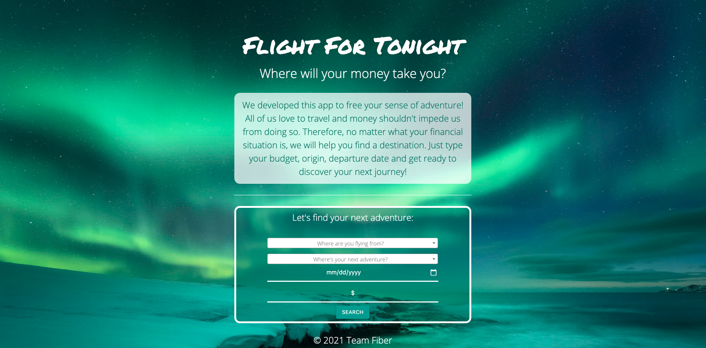
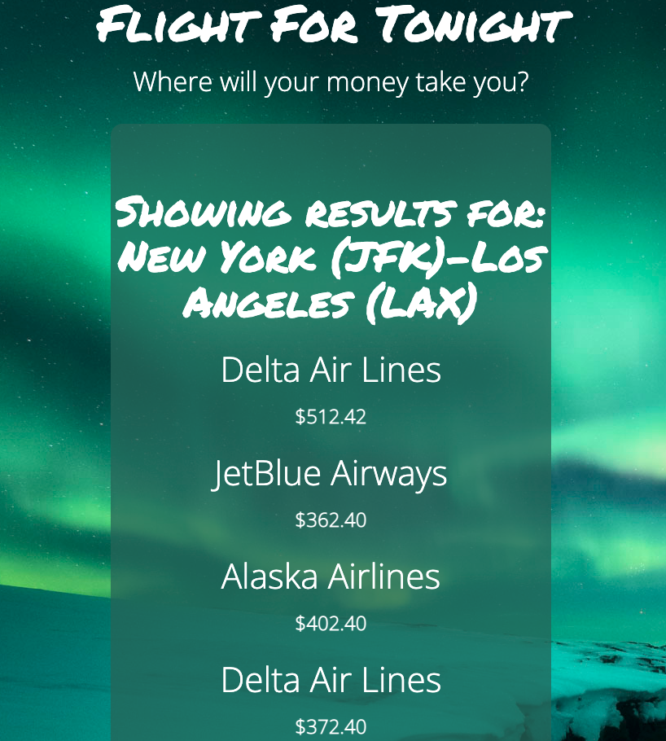
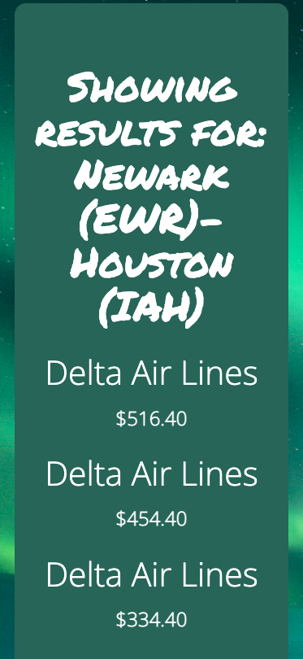

# flight-for-tonight

### For all adventurers out there, we have created a simple, easy to use app that filters flight tickets based on your destination and amount of money you want to spend.  

## Links

* 🌎 [Live Github Page] (https://mloercher.github.io/flight-for-tonight)
* 💾 [Repo] (https://github.com/mloercher/flight-for-tonight)

## <u>App - Preview:</u>


## Flight for tonight landing page desktop preview


## Flight for tonight destinations page desktop preview


## Flight for tonight landing page mobile preview


## Flight for tonight destinations page mobile preview


## Activity Instructions:

Select an origin, destination, date and price parameter then click search to get cheapest flight available to destination. 

    *If not receiving results after multiple tries, make sure local storage is empty and try again. To avoid this issue, we implemented a 'New Search' button at the bottom of the results list to clear local storage automatically.


## User Story

```
AS a user I want to be able to look at the cheapest flight I can purchase with the budget I have available...
WHEN I select an origin...
WHEN I select a destination…
WHEN I select a departure date...
WHEN I input the amount of money I have...  
THEN I am shown a list of destinations and flights according to my budget...
```

## Technologies Used
-HTML
-CSS
-JavaScript
-Third Party APIs: Duffel
-Plugins: Fuse.js, fuzzyComplete, select2
-Frameworks: Materialize
-Libraries: jQuery

## Resource Links

Duffel: https://duffel.com/
Fuse.js: https://fusejs.io/
fuzzyComplete: https://github.com/aliask/fuzzycomplete
select2: https://select2.org/
jQuery: https://jquery.com/


